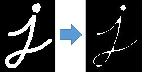

### Proyecto final opencv
#### Requerimientos
- version python -> 3.8.2
### EROSION
- La idea básica de la erosión es como la erosión del suelo, erosiona los límites del objeto en primer plano (siempre trate de mantener el primer plano en blanco). Entonces ¿Qué es lo que hace? El núcleo se desliza a través de la imagen (como en convolución 2D). Un píxel en la imagen original (ya sea 1 o 0) se considerará 1 solo si todos los píxeles debajo del núcleo son 1; de lo contrario, se erosiona (se pone a cero).

- Entonces, lo que sucede es que, todos los píxeles cerca del límite se descartarán dependiendo del tamaño del núcleo. Por lo tanto, el grosor o el tamaño del objeto en primer plano disminuye o simplemente la región blanca disminuye en la imagen. Es útil para eliminar pequeños ruidos blancos (como hemos visto en el capítulo del espacio de color), separar dos objetos conectados, etc.
### EJEMPLO

- el main.py es la clase principal

